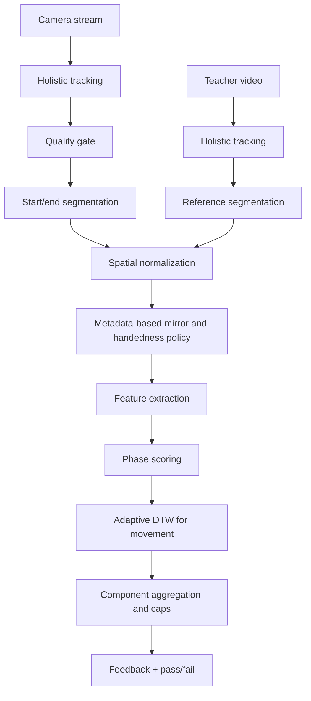

# Sign Scoring Engine: System Architecture and Execution Flow

This document describes how a student gesture is captured, normalized, aligned, and scored against the teacher ground-truth video in the client-side real-time scoring engine.

## Architecture Overview

The engine is fully client-side and runs in the browser. Two synchronized landmark streams are produced:
- Student stream from the webcam.
- Teacher stream from the lesson video.

Both streams pass through a versioned scoring pipeline to ensure fair comparison.
`scoringVersion: "v1"` keeps the legacy full-sequence DTW scorer available as
a fallback. `scoringVersion: "v2"` runs the quality-gated, segmented,
component-based scorer.

## Component Map

- **Landmark acquisition (MediaPipe Holistic):** [ui/app/hooks/use-holistic-tracking.ts](ui/app/hooks/use-holistic-tracking.ts)
- **Student capture UI (webcam + mirror):** [ui/app/components/learning/camera-practice.tsx](ui/app/components/learning/camera-practice.tsx)
- **Teacher video capture:** [ui/app/components/learning/lesson-card.tsx](ui/app/components/learning/lesson-card.tsx)
- **Normalization + scoring:** [ui/app/services/scoring.service.ts](ui/app/services/scoring.service.ts)

## End-to-End Execution Flow



## Versioned Scoring

The scorer is selected with `SignScoringMetadata.scoringVersion`:

- `v1`: legacy fallback. It compares the full student sequence to the full
  teacher sequence with normalized landmark DTW and the historical timing
  penalty. It does not require quality gating or segmentation.
- `v2`: default. It runs camera/landmark quality validation, trims idle frames,
  applies lesson-specific mirror/handedness policy, extracts multiple feature
  families, scores phases separately, aligns movement with adaptive DTW, and
  aggregates explainable components.

The public result remains backward compatible through `score`, `passed`,
`landmarkScore`, `handShapeScore`, `orientationScore`, `phaseScores`, and
`alignmentDiagnostics`. New debugging data is returned under `diagnostics`.

## 1) Data Acquisition (MediaPipe Holistic)

**Objective:** Capture pose + both hands concurrently for each video frame.

- The Holistic tracker runs in video mode and emits pose, left hand, and right hand landmarks on each frame. This is used for both the student webcam and the teacher reference video.
- Only upper-body pose landmarks are kept to focus on sign-relevant joints.

**Implementation:**
- Holistic setup and per-frame capture: [ui/app/hooks/use-holistic-tracking.ts](ui/app/hooks/use-holistic-tracking.ts)
- Teacher video is tracked when the lesson video plays: [ui/app/components/learning/lesson-card.tsx](ui/app/components/learning/lesson-card.tsx)
- Student webcam is tracked while camera is active: [ui/app/components/learning/camera-practice.tsx](ui/app/components/learning/camera-practice.tsx)

## 2) Signal Preprocessing

**Objective:** Stabilize raw landmarks and align timelines between camera and video streams.

### 2.1 EMA Smoothing (jitter removal)
For each landmark component:

$$
S_t = \alpha x_t + (1 - \alpha) S_{t-1}
$$

This reduces high-frequency camera jitter while preserving overall motion.

### 2.2 Confidence-Aware Filtering
Landmarks with low confidence are treated as missing to avoid contaminating the score. Missing points are assigned a fixed penalty later during distance computation.

### 2.3 Temporal Resampling (LERP)
The camera and video streams can have different FPS. Each stream is resampled onto a shared time grid using linear interpolation between frames:

$$
\hat{p}(t) = (1 - \lambda) p_i + \lambda p_{i+1}
$$

where $\lambda$ is the fractional offset between the two nearest frames.

## 3) Spatial Normalization (Viewpoint Invariance)

**Objective:** Remove differences in subject position, size, and camera yaw.

Normalization is applied per frame:

1. **Translate** to a center-chest origin (midpoint of shoulders).
2. **Scale** by shoulder width (distance between shoulders).
3. **Rotate** to align the shoulder axis horizontally.

### 3.1 Translation + Scale
For each point $p$ with origin $o$ and scale $s$:

$$
\hat{p} = \frac{p - o}{s}
$$

### 3.2 Rotation
The shoulder axis defines the rotation angle $\theta$. Each point is rotated around the origin:

$$
R(\theta) =
\begin{bmatrix}
\cos\theta & -\sin\theta \\
\sin\theta & \cos\theta
\end{bmatrix}
$$

**Implementation:** [ui/app/services/scoring.service.ts](ui/app/services/scoring.service.ts)

## 4) Edge Case Handling (Mirroring)

**Objective:** Ensure fair scoring for left-handed or mirrored camera setups.

The engine evaluates two sequences:
1. Original student sequence.
2. Horizontally flipped student sequence.

The final score uses the better match of the two. This prevents penalizing students whose dominant hand or camera mirror is inverted relative to the teacher recording.

## 5) Feature Extraction

**Objective:** Convert frames into comparable numeric features.

Each normalized frame contains:
- Pose landmarks (upper body).
- Left and right hand landmarks.
- Joint angles (elbow, shoulder, and finger flexion) for stability against minor spatial drift.

Hand shape scoring also extracts a dedicated normalized feature vector per
detected hand:
- pairwise fingertip distances,
- fingertip-to-wrist distances,
- finger flexion angles,
- thumb-index distance,
- palm openness,
- relative finger direction vectors.

These features are normalized by palm scale so they are less sensitive to hand
size and camera distance. The segmented score result exposes
`leftHandShapeScore`, `rightHandShapeScore`, and `overallHandShapeScore` through
the `handShapeScores` field, plus `handShapeScore` as the selected overall
component used in the final blended score. Optional missing hands are ignored;
required missing hands receive a hand-shape score of `0`.

Palm and wrist orientation scoring extracts:
- palm normal vector,
- wrist-to-middle-finger direction,
- index-to-pinky direction,
- relative hand rotation vector.

Orientation is scored per hand after segmentation and mirror-policy selection,
so mirrored webcam handling uses the same candidate sequence as the selected
final score. The result exposes `leftHandOrientationScore`,
`rightHandOrientationScore`, and `overallOrientationScore` through
`orientationScores`, plus `orientationScore` as the selected overall component.
Required missing hands receive an orientation score of `0`; optional missing
hands are ignored. The final blended score uses `orientationWeight` from the
per-sign metadata.

**Implementation:** [ui/app/services/scoring.service.ts](ui/app/services/scoring.service.ts)

## 6) Sequence Alignment and Distance

**Objective:** Align timing differences and compute similarity.

### 6.1 Frame Distance
Frame distance combines torso, arms, hands, and joint angles using weights:
- Hands: 0.7
- Arms: 0.2
- Torso: 0.1
- Joint angles are weighted by 1.2
- Missing landmarks incur a fixed penalty

**Implementation:** [ui/app/services/scoring.service.ts](ui/app/services/scoring.service.ts)

### 6.2 Dynamic Time Warping (DTW)
DTW aligns the two sequences under timing drift with a window constraint (45 frames). The cumulative cost is normalized by alignment length.

**Implementation:** [ui/app/services/scoring.service.ts](ui/app/services/scoring.service.ts)

## 7) Anti-Cheat System (Motion Variance Check)

**Objective:** Detect "statue" cheating (no movement).

- Motion variance is computed as the 3D bounding volume traced by both wrists over time.
- If the student motion is below a fraction of teacher motion (and the teacher motion is non-trivial), the system returns a fail score immediately.

**Implementation:** [ui/app/services/scoring.service.ts](ui/app/services/scoring.service.ts)

## 8) Component-Based Final Score

**Objective:** Combine sign-relevant components into a bounded 0-100 final score.

- Raw component scores are produced for hand shape, hand position, motion path,
  hand orientation, timing, start pose, end pose, and body/arm posture.
- Each component remains on a 0-100 scale.
- The landmark DTW diagnostics also expose `averageCost`, `baseScore`,
  `finalScore`, `handScore`, `armScore`, `torsoScore`, `angleScore`,
  `missingLandmarkRatio`, `studentFrames`, `teacherFrames`,
  `sequenceLengthRatio`, and `timingPenalty`.
- Hand landmark comparison respects `requiredHands` and `dominantHand`, so a
  one-hand lesson is not penalized for an optional hand being absent.
- Lesson metadata supplies component weights. Missing optional components are
  ignored by removing their weight from the denominator.
- The weighted score is capped when a minimum requirement fails:
  - required hand missing,
  - unrelated motion,
  - critically wrong hand shape for hand-shape-heavy signs.
- Tracking quality is still blocked before scoring by the student quality gate.

Formula:

```ts
weightedScoreBeforeCaps =
  sum(componentScore * componentWeight) / sum(availableComponentWeights);

finalScore = clamp(min(weightedScoreBeforeCaps, ...activeCaps), 0, 100);
```

The result exposes both `componentScores` and `finalScoreAggregation`, including
the pre-cap weighted score, normalized scoring inputs, and cap diagnostics.

**Implementation:** [ui/app/services/scoring.service.ts](ui/app/services/scoring.service.ts)

## Key Constants (Current Implementation)

- DTW window: 45 frames
- Sensitivity multiplier: 60
- Timing ratio threshold: 2.0
- Timing penalty: 10
- Motion ratio threshold: 0.15
- Motion minimum reference: 0.02
- Motion fail score: 15
- Missing landmark penalty: 0.45

See [ui/app/services/scoring.service.ts](ui/app/services/scoring.service.ts) for the authoritative values.

## Per-Sign Scoring Metadata

Each lesson can provide optional scoring metadata. The scoring engine merges
lesson metadata with safe defaults, so missing fields do not break scoring.

```ts
type SignScoringMetadata = {
  scoringVersion: "v1" | "v2";
  requiredHands: "any" | "left" | "right" | "both" | "none";
  allowMirror: boolean;
  requiresExactHandedness: boolean;
  dominantHand: "left" | "right" | null;
  minPassingScore: number;
  handShapeWeight: number;
  positionWeight: number;
  motionWeight: number;
  orientationWeight: number;
  timingWeight: number;
  startPoseWeight: number;
  endPoseWeight: number;
  bodyArmPostureWeight: number;
  requiredHandMissingScoreCap: number;
  unrelatedMotionScoreCap: number;
  wrongHandShapeScoreCap: number;
  handShapeCriticalThreshold: number;
  motionSimilarityCriticalThreshold: number;
  expectedDuration: number | null;
  difficultyLevel: "easy" | "medium" | "hard";
  minWindowSize: number;
  maxWindowSize: number;
  windowRatio: number;
  strictTimingMode: boolean;
};
```

Metadata may be attached directly as `lesson.scoring_metadata`, or provided
through an exercise payload with `type: "scoring_metadata"`.

Mirror and handedness policy:
- `allowMirror: true` lets the engine compare both original and flipped student
  landmarks, then select the better candidate.
- `allowMirror: false` still computes a flipped diagnostic score, but the
  original candidate is selected.
- `requiresExactHandedness: true` selects the original candidate only and
  applies a handedness penalty when the flipped candidate scores better.
- `dominantHand` can require the quality gate to see a specific hand when
  `requiredHands` is otherwise `"any"`.
- The webcam preview is visually mirrored in the UI, but MediaPipe landmark
  coordinates are not mirrored by CSS. The route passes that runtime context to
  the scorer explicitly.

Mirror diagnostics include `mirrorModeUsed`, `originalScore`, `flippedScore`,
`selectedScore`, and `handednessPenalty`.

V2 diagnostics include:

```ts
type SignScoringDiagnostics = {
  scoringVersion: "v1" | "v2";
  trackingQuality: StudentQualityCheckResult | null;
  segmentationResult: {
    user: GestureSegmentationMetadata | null;
    reference: GestureSegmentationMetadata | null;
  };
  dtwDiagnostics: DtwAlignmentDiagnostics | null;
  featureExtraction: FeatureExtractionDiagnostics | null;
  componentScores: ScoringComponentScores | null;
  finalScore: number | null;
  feedbackMessages: string[];
  fallbackUsed: boolean;
  fallbackReason: string | null;
};
```

DTW alignment uses an adaptive window instead of a fixed global value. The
window is derived from the reference sequence length, `expectedDuration`,
`difficultyLevel`, `windowRatio`, and `strictTimingMode`, then clamped between
`minWindowSize` and `maxWindowSize`. Strict timing mode keeps the window tighter
and can reject excessive length mismatches instead of over-aligning unrelated
movement. The segmented score result exposes `alignmentDiagnostics` with
`averageCost`, `alignmentLength`, `windowSizeUsed`, `timingPenalty`,
`sequenceLengthRatio`, and `timingSimilarityScore`.

Phase scoring splits the selected segmented sign into:
- `startPoseScore`: strict comparison of the initial hold window,
- `motionScore`: adaptive-DTW comparison of the middle stroke,
- `endPoseScore`: strict comparison of the final hold window.

The final aggregation uses `startPoseScore`, `motionScore`, and `endPoseScore`
as separate weighted components instead of hiding them inside one DTW score.
Start and end pose comparisons use stricter sensitivity because incorrect hand
placement can change the sign even when the movement path is similar. The result
also returns human-readable phase feedback such as incorrect start position,
mismatched movement path, incorrect final position, or timing mismatch.

Example profiles:

```ts
const oneHandStatic = {
  scoringVersion: "v2",
  requiredHands: "right",
  allowMirror: true,
  requiresExactHandedness: false,
  dominantHand: "right",
  minPassingScore: 72,
  handShapeWeight: 0.42,
  positionWeight: 0.34,
  motionWeight: 0.04,
  orientationWeight: 0.1,
  timingWeight: 0.03,
  startPoseWeight: 0.03,
  endPoseWeight: 0.04,
  bodyArmPostureWeight: 0.04,
  requiredHandMissingScoreCap: 30,
  unrelatedMotionScoreCap: 45,
  wrongHandShapeScoreCap: 50,
  handShapeCriticalThreshold: 55,
  motionSimilarityCriticalThreshold: 30,
  expectedDuration: 1000,
  difficultyLevel: "easy",
  minWindowSize: 4,
  maxWindowSize: 18,
  windowRatio: 0.22,
  strictTimingMode: true,
};

const oneHandMovement = {
  scoringVersion: "v2",
  requiredHands: "right",
  allowMirror: true,
  requiresExactHandedness: false,
  dominantHand: "right",
  minPassingScore: 74,
  handShapeWeight: 0.22,
  positionWeight: 0.24,
  motionWeight: 0.34,
  orientationWeight: 0.07,
  timingWeight: 0.07,
  startPoseWeight: 0.03,
  endPoseWeight: 0.03,
  bodyArmPostureWeight: 0.05,
  requiredHandMissingScoreCap: 35,
  unrelatedMotionScoreCap: 42,
  wrongHandShapeScoreCap: 58,
  handShapeCriticalThreshold: 45,
  motionSimilarityCriticalThreshold: 38,
  expectedDuration: 1400,
  difficultyLevel: "medium",
  minWindowSize: 5,
  maxWindowSize: 28,
  windowRatio: 0.3,
  strictTimingMode: false,
};

const twoHandMovement = {
  scoringVersion: "v2",
  requiredHands: "both",
  allowMirror: false,
  requiresExactHandedness: true,
  dominantHand: null,
  minPassingScore: 78,
  handShapeWeight: 0.2,
  positionWeight: 0.25,
  motionWeight: 0.32,
  orientationWeight: 0.08,
  timingWeight: 0.08,
  startPoseWeight: 0.03,
  endPoseWeight: 0.04,
  bodyArmPostureWeight: 0.05,
  requiredHandMissingScoreCap: 30,
  unrelatedMotionScoreCap: 40,
  wrongHandShapeScoreCap: 55,
  handShapeCriticalThreshold: 45,
  motionSimilarityCriticalThreshold: 40,
  expectedDuration: 1800,
  difficultyLevel: "hard",
  minWindowSize: 6,
  maxWindowSize: 36,
  windowRatio: 0.28,
  strictTimingMode: true,
};
```

## Summary

The scoring engine normalizes both student and teacher sequences into a shared coordinate system, extracts robust landmark, hand shape, orientation, phase, and posture features, aligns motion with adaptive DTW, and computes a weighted component score with explicit caps for minimum requirements. The quality gate and motion caps prevent poor tracking or unrelated movement from receiving a misleading passing score.
